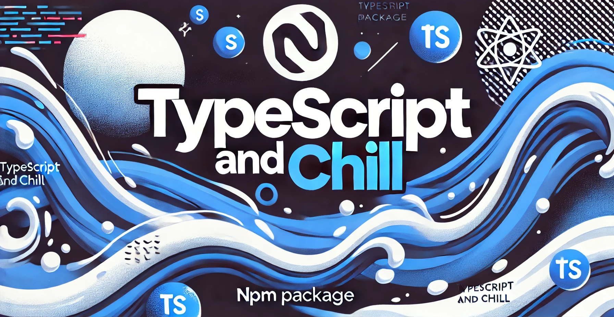

# TypeScript and Chill



## Overview

**TypeScript and Chill** is an NPM package that automates the process of setting up a modern TypeScript development environment. Designed for developers working with **AWS CDK**, **serverless applications**, and **microservices**, this CLI tool ensures that every new project starts with a standardized and optimized development environment.

This tool eliminates the need for manually setting up **ESLint, Prettier, Jest, AWS CDK**, and **CI/CD pipelines**, saving time and reducing setup inconsistencies across projects.

## Features

✅ **Interactive CLI Setup** - Choose what to install based on project needs, or use the `-y` flag for automatic setup  
✅ **Project Structure Creation** - Automatically sets up directories for CDK and source code  
✅ **AWS CDK Initialization** - Ensures an up-to-date `cdk.json` configuration with the correct bin reference  
✅ **Linting & Formatting** - Installs and configures **Biome**
✅ **Testing** - Configures **Vitest** for unit testing  
✅ **CI/CD Integration** - Automatically sets up GitHub Actions for deployment  
✅ **Automatic TypeScript Compilation** - Installs and configures `esbuild`  
✅ **Deployment Ready** - Ensures TypeScript projects are ready for AWS deployments

## Installation

To install and use this package in a new project:

```sh
npx typescript-and-chill
```

To automatically accept all default options and install everything:

```sh
npx typescript-and-chill -y
```

This will run the interactive CLI (or default to "yes" for all options if `-y` is used), guiding you through the setup process.

## How It Works

When you run `npx typescript-and-chill`, the CLI:

1. **Prompts for setup options** (CDK, Jest, ESLint, etc.), unless `-y` is specified.
2. **Installs dependencies** (`aws-cdk`, `biome`, `vitest`, `typescript`, `esbuild`).
3. **Creates project directories** (`cdk/`, `cdk/stacks/`, `src/`).
4. **Generates configuration files** (`.biome.json`, `cdk.json`).
5. **Ensures `cdk.json` is updated** - The correct bin file reference is automatically set.
6. **Sets up CI/CD** - Adds a GitHub Actions workflow for automated deployments.
7. **Ensures TypeScript Compilation** - Installs `esbuild` for efficient TS-to-JS compilation.

## Directory Structure

After running the CLI, your project will have the following structure:

```
my-new-project/
├── bin/
│   ├── app.ts       # CDK application entry file
├── cdk/
│   ├── stacks/      # CDK stacks directory
├── src/             # Application source code (Lambda functions, etc.)
├── .github/workflows/
│   ├── deploy.yml   # CI/CD GitHub Actions workflow
├── package.json     # Project dependencies and scripts
├── README.md        # Documentation
├── tsconfig.json    # TypeScript configuration
├── .biome.json      # Biome configuration
├── cdk.json         # AWS CDK configuration (correctly references bin/app.js)
└── .gitignore       # Git ignore rules
```

## Customization

You can choose which features to enable during setup:

- Install **AWS CDK** (`cdk init` is automatically run for accuracy).
- Enable **Biome** for testing.
- Add **CI/CD GitHub Actions workflow**.
- Install **TypeScript** and `esbuild` for deployments.
- Use `-y` to skip prompts and install everything automatically.

## Running Tests

Unit tests ensure that all setup scripts function correctly:

```sh
npm test
```

This will run Vitest tests that validate the correct setup of **Biome, Vitest, AWS CDK, CI/CD workflows, and TypeScript compilation**.

## Contributing

Want to improve this package? Feel free to contribute by submitting a pull request!

## License

MIT License
